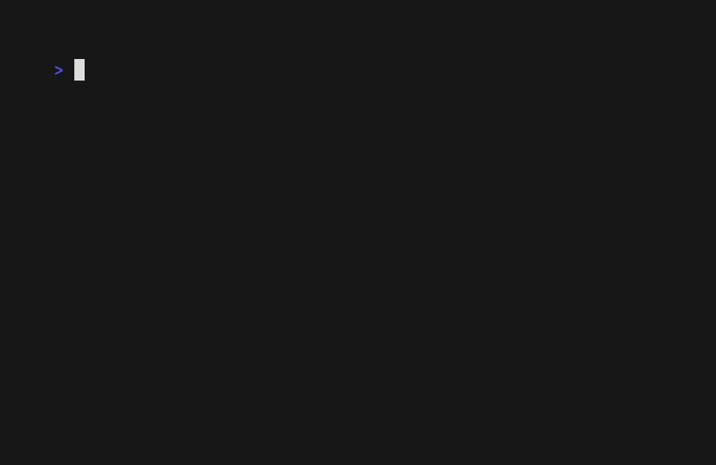

# Крестики-нолики 5x5 на Haskell

Консольная игра. Поле 5x5, побеждает тот, кто первым соберёт 4 в ряд по горизонтали, вертикали или диагонали. Можно играть вдвоём или против бота одного из трёх уровней.



## Запуск

Нужны GHC и cabal (например, `brew install ghc cabal-install` или через ghcup).

```
cabal run
```

## Как играть

В меню выбери режим. Ход вводится как номер строки и столбца через пробел, например `2 3`. Человек играет за X и ходит первым, бот играет за O.

Счёт ведётся только в играх против бота и сохраняется в файле score.dat:

```
            победа   ничья   поражение
лёгкий        +5      -10      -125
средний      +25       +3       -25
сложный     +125      +10        -5
```

## Файлы

- GameState.hs - поле, ходы, проверка победы
- GameBot.hs - бот
- GameScore.hs - счёт
- GameInterface.hs - меню и ввод в консоли
- demo.tape - сценарий записи demo.gif (`vhs demo.tape`)
